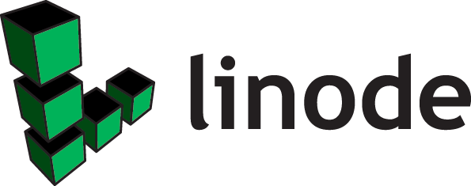
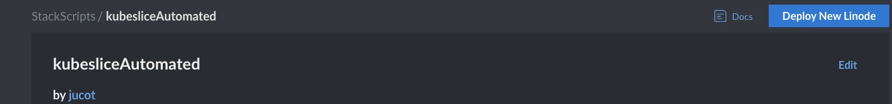
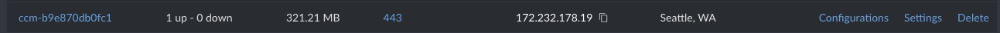
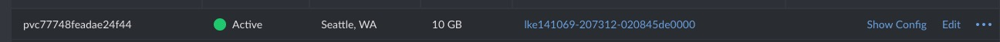
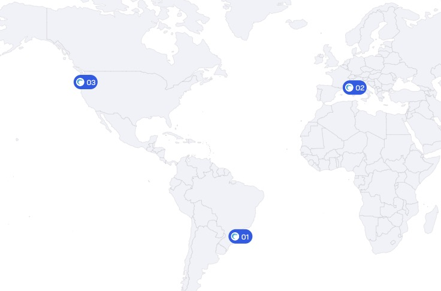

# kubeslice Automated Setup
Kubeslice installation from scratch creating LKE clusters required.

  
  

The purpose of this repo is to have a easy way to start with kubeslice on LKE. This basically automates the installation process detailed on https://docs.avesha.io/documentation/enterprise/0.7.0/.

To facilitate the instalation, an Akamai Connected Cloud stackscript associated with this ansible playbook has been created and can be used to deploy the whole setup.

Essentially, it deploys a VM that in turns is going to pull the ansible scripts and deploy it from there. Several kubernetes tools are installed on this machine to be able to use for admin purposes. 

If you are going to run the ansible script manually just make sure to populate required vars to ansible/kubeslicemaster/group_vars/linode/vars.

1-Go to https://cloud.linode.com/stackscripts/1261114:

2-Click on Deploy New Linode:

  

3-Fill the required fields. A little explanation of each of them:

Linode API token: API token required to deploy the infrastructure.

Controller cluster label (required): The LKE label for your Kubeslice manager/controller cluster.

Number of nodes for Controller cluster (required): The number of nodes for the controller's node pool.

worker cluster label, each cluster will be named label+region (required): The label for each of the worker nodes. 

The regions where you want to deploy your worker clusters: Each of the regions where you want to deploy worker clusters.

Number of nodes for worker cluster (required): The number of nodes for each of the worker clusters.

Kubeslice project name (required): The project name for the kubeslice setup (more project can be added after the installation has finished)

Kubeslice image secret username (required): Contact kubeslice if you dont have this info to request a license.

Kubeslice image secret password (required): Contact kubeslice if you dont have this info to request a license.

Kubeslice image secret email (required): Contact kubeslice if you dont have this info to request a license.

Kubeslice License custom user name (required): Contact kubeslice if you dont have this info to request a license.

The datacenter for your Controller cluster: Default Seattle, but you can change it.

Controller kubernetes version: Kubernetes version of your Kubeslice manager/controller.

The Plan for your Controller nodes: The plan specs for the VMs that are part of the controller pool.

Worker kubernetes version:  Kubernetes version of your Kubeslice worker.

The Plan for your Worker nodes: The plan specs for the VMs that are part of the workers pools.

Kubeslice License Type: The license type you acquired from Kubeslice

Kubeslice License Mode: The license mode of your Kubeslice license.

Then the image and region for the deploy machine.

By the end of the deployment you will have created:

--A kubernetes cluster for the controller as well any number of workers you added.

--The controller will create a volume through PV and a node balancer for the kubeslice ui:

  
  

-Two default slices, one named production and another testing.

You can either onboard your apps on these or create new slices from the UI.

  

